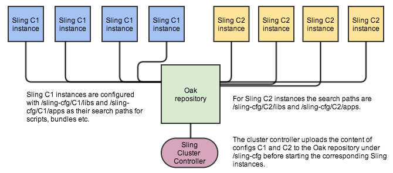

Sling Devops Experiments, Volume 2: Atomic Switch of System Content
===================================================================

This is the second of a series of experiments about how [Apache Sling](http://sling.apache.org)
can be made more devops-friendly. 
 
Building on the atomic configuration switching mechanism of the previous 
[vol1](../../tree/vol1) experiment, we add more 
realistic Sling configurations to the Sling instances, to demonstrate atomic switching of a setup 
that includes both scripts and OSGi services, along with a shared content repository.

Note that for this set of experiments the term "Sling configuration" includes everything that 
defines the behavior of a Sling instance: scripts, OSGi services, OSGi configurations, etc.

The general scenario is similar to the previous experiment, and we use the same 
components to implement the switching: cluster controller, HTTP front-end
and a load balancer configured by the cluster controller, Zookeeper for coordination and two
sets of Sling instances with Sling configurations C1 and C2. 

The difference with the previous experiment is that our Sling instances get an actual Sling configuration,
consisting of a rendering script that combines values provided by an OSGi service with repository content.

The demo scenario then upgrades both the OSGi service and rendering script and the test HTTP client verifies
that the resulting output switches atomically from C1 to C2.



The diagram shows how the Sling instances are configured. They all share the same Oak repository,
but the C1 and C2 sets of instances are configured with different Sling search paths. For a simple example
like this that's sufficient to implement the different behavior of C1 and C2. Real applications might have
hardcoded the default Sling search paths (/libs and /apps) in places, and might
have spread system content outside of those paths. Both these issues will need to be addressed to use this
technique for real applications, before this atomic switching mechanism can be used.

Implementation
--------------

This prototype calls for three major differences with the previous prototype:
* **Shared Oak Repository**: implemented using Oak 0.18 with the MongoDB backend (`DocumentNodeStoreService` component).
  * This required changes to the existing Oak Server bundle as well as the Oak Core bundle (see 0.18 patch at [SLING-3479](https://issues.apache.org/jira/browse/SLING-3479) and the accompanying comment regarding [OAK-1581](https://issues.apache.org/jira/browse/OAK-1581)).
  * `DocumentNodeStoreService` can be configured using the [setup-minion-mongo.sh](scripts/setup-minion-mongo.sh) script.
* **Configuration of Search Paths**: must be done in two components, `JcrInstaller` and `JcrResourceResolverFactoryImpl`.
  * This is tricky to do manually because multiple instances of each may spawn, and instead can be done using the [setup-minion-configs.sh](scripts/setup-minion-configs.sh) script.
* **Actual Sling Configuration**: modelled by two versions of a test bundle with a Sling service and two versions of a test script using the service. Once the search paths are configured, bundle JARs can simply be put under `/sling-cfg/<config>/apps/install` to be installed, and scripts under `/sling-cfg/<config>/apps`.
  * This mechanism can also be leveraged to convert a standard standalone Launchpad instance to a Minion instance.
  * The [setup-minion-repo.sh](scripts/setup-minion-repo.sh) script can be used to convert an instance to a Minion instance and to upload the appropriate version of the test bundle and the test script to it. The output of the test script can then be seen at `http://<sling>/mynode.test`.

Additionally, while in the previous prototype Minion instances were announcing themselves to ZooKeeper immediately upon startup, here they perform several self-tests to check whether they are ready before doing that. This mechanism is achieved using the [Sling Health Checks](http://sling.apache.org/documentation/bundles/sling-health-check-tool.html) based on JUnit tests. The following tests have been implemented:
* `ComponentTest` verifies that both `JcrInstaller` and `JcrResourceResolverFactoryImpl` components are present and active
* `SearchPathTest` verifies that both components are configured with the correct search paths
* `BundleTest` verifies that all bundles are active and all bundle fragments are resolved (as a way to see if `JcrInstaller` installed new bundles from each new search path; it is therefore assumed that the `minion` bundle itself is installed from there)

Running
-------

Before running this prototype, it is necessary to prepare a Launchpad standalone JAR as follows:

1. Checkout [Oak Core 0.18](http://svn.apache.org/repos/asf/jackrabbit/oak/tags/jackrabbit-oak-0.18/oak-core/).
2. Manually apply fix from [OAK-1581](https://issues.apache.org/jira/browse/OAK-1581) to it.
3. `mvn clean install` it.
4. Checkout [Sling trunk](http://svn.apache.org/repos/asf/sling/trunk/) (these steps were tested with revision 1589952).
5. Apply [patch](https://issues.apache.org/jira/secure/attachment/12636928/SLING-3479-Oak018.patch) from [SLING-3479](https://issues.apache.org/jira/browse/SLING-3479) to it.
6. Navigate to launchpad/builder and `mvn clean install`.

The standalone Launchpad JAR can now be found under launchpad/builder/target as org.apache.sling.launchpad-7-SNAPSHOT-standalone.jar.

### Vagrant

The easiest way to run the prototype is using [Vagrant](http://www.vagrantup.com/).

#### Environment

The current configuration creates five virtual machines running Ubuntu 12.04:
* 1 Orchestrator machine, `orchestrator` at 10.10.10.10, which is also the ZooKeeper server, the MongoDB server, and the web server (httpd front-end)
* 2 Minion machines with config C1, `minion-C1-1` at 10.10.10.11 and `minion-C1-2` at 10.10.10.12
* 2 Minion machines with config C2, `minion-C2-1` at 10.10.10.21 and `minion-C2-2` at 10.10.10.22

Machines are set up by copying up this project and building it on the machines, and then by copying up the standalone Launchpad JAR and running Sling, and finally by configuring it. `orchestrator` in addition is set up by configuring ZooKeeper, MongoDB, and httpd.

#### Launching

The following is necessary to run the prototype with Vagrant:

1. Navigate to vagrant directory.
2. Change `LAUNCHPAD_STANDALONE_PATH` variable on line 123 of Vagrantfile to point to the standalone Launchpad JAR built above.

Then, to bring up the Orchestrator and the two Minion C1 machines:
```
vagrant up --provision orchestrator minion-C1-1 minion-C1-2
```

If everything goes well, after Vagrant is done Sling with config C1 should be at <http://10.10.10.10/>, and the output of the test script at <http://10.10.10.10/mynode.test>.

Afterwards, to bring up the two Minion C2 machines:
```
vagrant up --provision minion-C2-1 minion-C2-2
```

Eventually Sling at <http://10.10.10.10/> should switch to config C2.

Note: to re-provision machines that are already up, `vagrant provision` should be used instead of `vagrant up --provision`.

Finally, machines can be brought down using
```
vagrant halt
```

or forever destroyed using
```
vagrant destroy
```

#### Troubleshooting

Vagrant machines can be `ssh`ed to using `vagrant ssh <machine>`. Sling keeps its log in the `~/sling/sling.out` file.

If not everything goes well, <http://10.10.10.10/> will be inaccessible, which could sometimes be due to network problems:

* If `orchestrator` is running and `10.10.10.10` is not pingable, try resetting the `vboxnet0` network interface on the host (`ifconfig vboxnet0 down` followed by `ifconfig vboxnet0 up`).

More often, this would be due to one of the minions not initializing properly. The easiest way to troubleshoot this is to download [ZooKeeper](http://zookeeper.apache.org/) and connect to the ZooKeeper server on `orchestrator` using
```
bin/zkCli.sh -server 10.10.10.10:2181
```

* If `ls /sling` lists only one instance, this means the second instance did not initialize properly. Re-provision it.
* If `ls /sling` does not list any instances, this means that the first instance did not initialize properly. Re-provision it. If this does not help, re-provision the whole setup (sometimes the oak database becomes corrupt and Minions start throwing `root node does not exist at revision xyz` exceptions).

Testing
-------

To verify that the switch between the Sling configs is atomic (from the client point of view), the HttpResourceMonitor tool from the `org.apache.sling.devops.tools` module can be used. This tool sends an HTTP request over and over in a single thread and logs changes in responses.

Usage:
```
HttpResourceMonitor [host [resource]]
```

To monitor the output of our test script while running the prototype with Vagrant:
```
HttpResourceMonitor 10.10.10.10 /mynode.test
```
