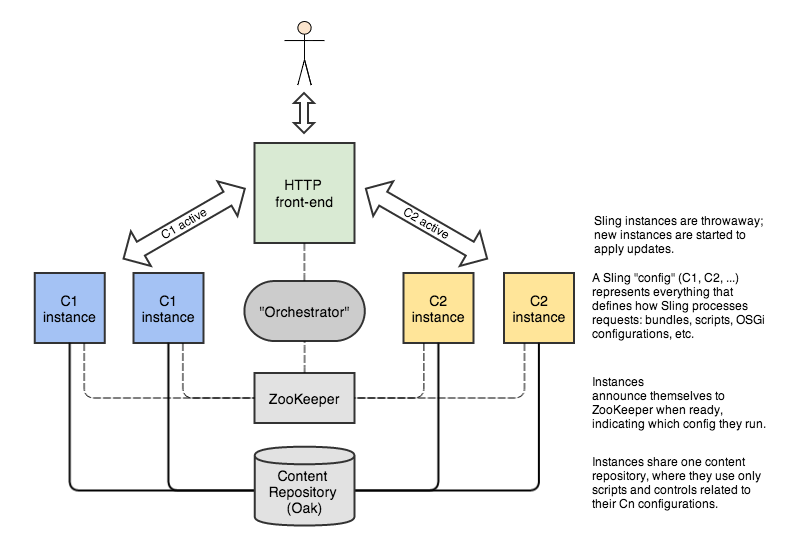

Sling DevOps Experiments Demo
=============================

This is the demonstration of Volume 4 of a series of experiments about how [Apache Sling](http://sling.apache.org/) can be made more DevOps-friendly.

The goal of these experiments is to be able to update a running Sling application to a new version atomically and without downtime. The basic principle used in the experiments is to think of an active Sling instance as immutable; when an update to it is needed, a new updated Sling instance must be started instead. This approach greatly simplifies the task of making the update atomic.

Implementation Details
----------------------

The current experiment is implemented via a cluster controller, called the **Orchestrator**, that monitors a Sling configuration file in a Git repository for changes, is able to start Sling instances, referred to as **Minions**, from this configuration every time it changes, detect when the Minions are ready, and then to atomically switch the HTTP front-end that forwards HTTP requests to Sling instances to use the new ones. The configuration file defines the bundles and configurations of the Sling application; in the broader sense, it defines a particular *version* of it. A change in the configuration file therefore represents an update of the application.

Sling instances are started with the help of [Crankstart](http://svn.apache.org/repos/asf/!svn/bc/1605027/sling/trunk/contrib/crankstart/), an experimental launcher of OSGi applications. Bundles and configurations comprising the application are listed in a text file, referred to as a **crank file**, which Crankstart reads and starts and configures an OSGi framework accordingly. Since Sling is an OSGi application, Sling applications can be crankstarted too. The configuration file that the Orchestrator monitors in a Git repository is a crank file.

All Minions are configured to share the same [Apache Oak](http://jackrabbit.apache.org/oak/) repository so that there is no need to migrate content across versions of the Sling application. Since updates to the application may call for changes to the `/apps` and `/libs` directories in the repository, the Minions are configured to use `/sling-cfg/<version>/apps` and `/sling-cfg/<version>/libs` directories instead, where `<version>` represents the current version (configuration) of the Sling application. This ensures that a running version of the application is not modified by an ongoing update.

The Orchestrator and Minions communicate via [Apache ZooKeeper](http://zookeeper.apache.org/). This is how the Orchestrator detects when new Minions are ready.

The image below illustrates the different components of the above scenario. `C1` and `C2` represent the two different configurations of a Sling application.

Demo Scenario
-------------

This demo shows how a running Sling application is updated to a newer version. The atomicity of the update is verified by the `HttpResourceMonitor` tool developed as part of the experiments, which continuously sends HTTP GET requests to a specific resource and logs changes in the responses.

The demo scenario is as follows:

1. Initially the HTTP front-end (HTTP server on `localhost`) is not running.
2. We start `HttpResourceMonitor`.
3. We start ZooKeeper and MongoDB (back-end used for Oak).
4. We crankstart the Orchestrator. Once it is initialized, we can see its status page. We already have an initial Minion crank file in the Git repository, so the Orchestrator tells us to start Minions from it (\*).
5. We crankstart the initial Minions and see that the HTTP front-end is now running and shows the initial version of the Sling application.
6. We commit an updated Minion crank file to the Git repository. The Orchestrator detects the commit and tells us to start Minions from the new crank file (\*).
7. We crankstart the new Minions and see that the Sling application on the HTTP front-end has successfully updated. `HttpResourceMonitor` shows that the response changed only once and without downtime in-between, indicating that the update was indeed atomic and without downtime. The Orchestrator now tells us to stop the Minions running the older version as they are no longer necessary (\*).
8. We stop the old Minions and verify that the HTTP front-end is still responsive.

(\*) Starting and stopping Minions will be automated in the future.
